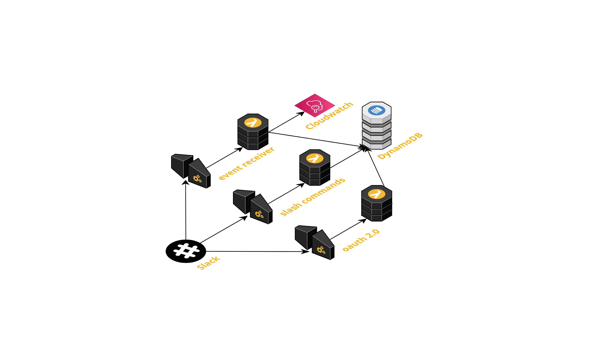

# slackbot-aws-lambda

## Medium article
The documentation for the code in this repository is in my [medium article](https://medium.com/p/41c4a6c0f99d/edit)

## Lambdas

| File                     	| Description                                                     	|
|--------------------------	|-----------------------------------------------------------------	|
| [lambda/oauth2.py](https://github.com/cazabec/slackbot-aws-lambda/blob/main/lambda/oauth2.py)         	| Called by slack when someone clicks on your public install link 	|
| [lambda/slash_command.py](https://github.com/cazabec/slackbot-aws-lambda/blob/main/lambda/slash_command.py)  	| Called by slack when a slash command is entered                 	|
| [lambda/event_receiver.py](https://github.com/cazabec/slackbot-aws-lambda/blob/main/lambda/event_receiver.py) 	| Called by slack when there is an event in the workspace         	|